<p align="center">
  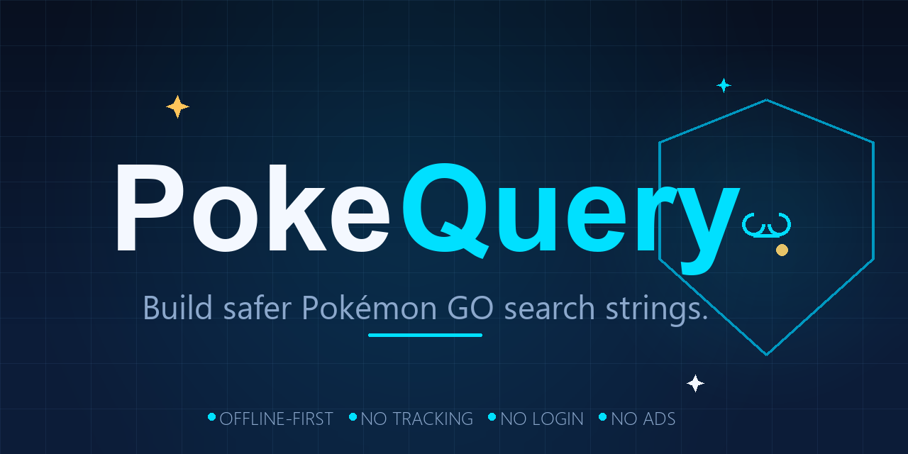
</p>

<p align="center">
  <strong>Build safer Pokémon GO search strings.</strong><br/>
  An offline-first Android utility that turns plain-English goals into copy-ready, safety-checked search strings.
</p>

<p align="center">
  
  
  
  
  
  
  
</p>

<p align="center">
  <em>Unofficial fan-made utility. Not affiliated with, endorsed by, or sponsored by Niantic, The Pokémon Company, or Nintendo.</em>
</p>

---

## What is PokeQuery?

PokeQuery is a **local-only Android app** that helps Pokémon GO players organize their storage. You pick a goal — *Safe Cleanup*, *2× Candy Prep*, *Trade Fodder* — and PokeQuery builds a carefully constructed **search string** from a tested rule engine. You then **manually copy** that string and **paste it into Pokémon GO** yourself.

It is **not** an IV checker, scanner, bot, automation tool, or Pokémon GO account tool. It generates text, and you decide what to do with it. Every risky action is gated behind an explicit review step, and protected categories (shiny, legendary, mythical, shadow, lucky, traded, favorite, high-IV) are excluded by default.

> Why "safer"? Because a badly-built search string can surface the wrong Pokémon and lead to an accidental transfer. PokeQuery's engine is conservative: when in doubt, it protects rather than exposes.

---

## Screenshots

<p align="center">
  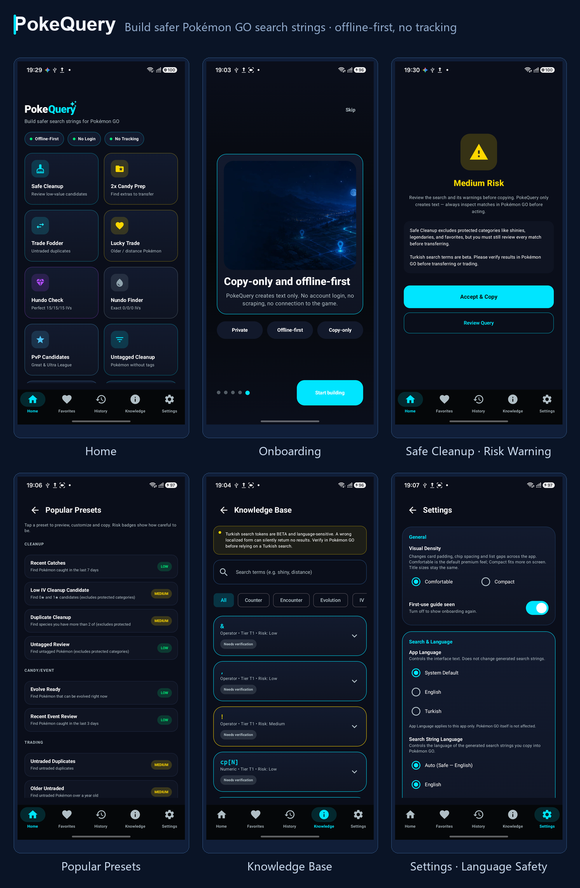
</p>

<details>
<summary><strong>📸 Full screen gallery</strong></summary>

| | | |
|:---:|:---:|:---:|
| 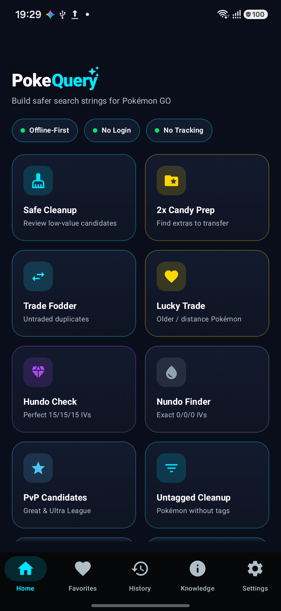 | 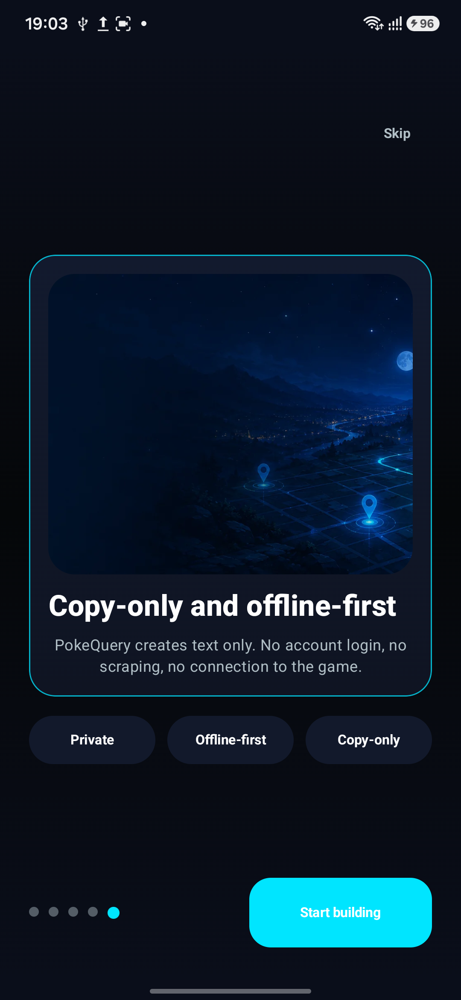 | 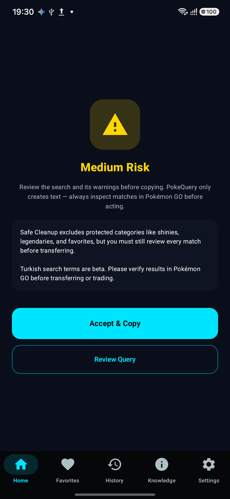 |
| **Home** | **Onboarding** | **Safe Cleanup · Risk Warning** |
| 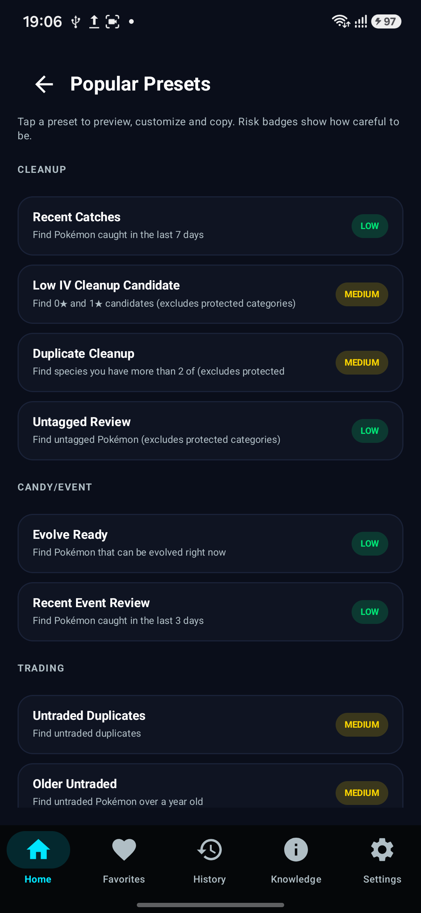 | 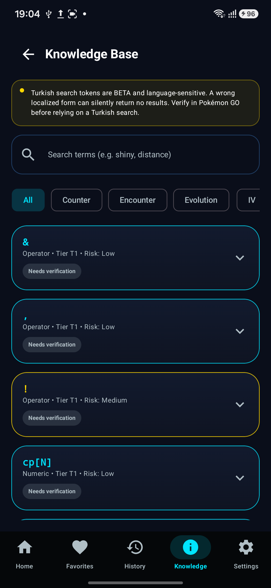 | 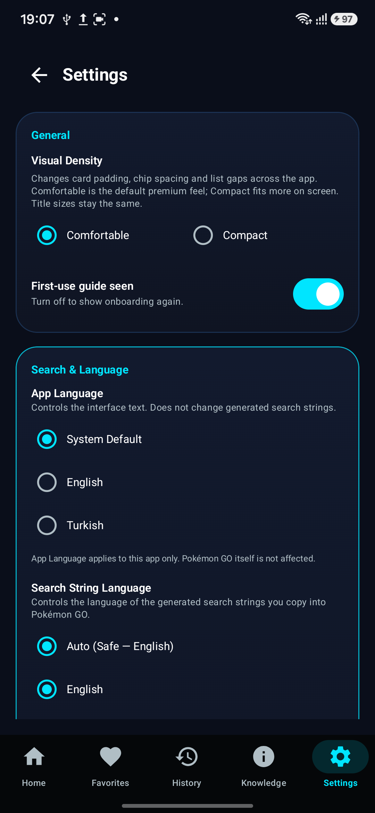 |
| **Popular Presets** | **Knowledge Base** | **Settings** |
| 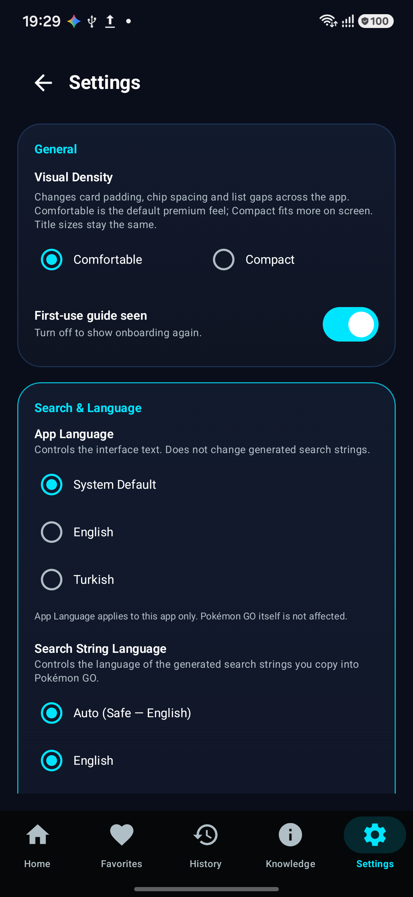 | 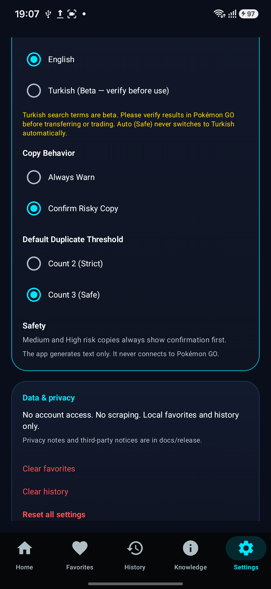 | 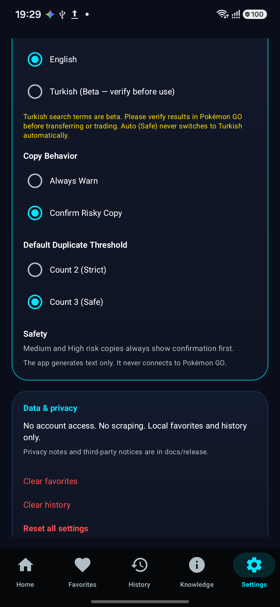 |
| **App Language** | **Search String Language** | **Turkish (Beta)** |

</details>

---

## Key features

| Feature | What it does |
|---|---|
| 🛡️ **Safe Cleanup** | Builds a conservative string that hides everything worth keeping, so only clearly-redundant Pokémon are left visible. Routes through Risk Warning before copying. |
| 🍬 **2× Candy Prep** | Surfaces candidates worth transferring during a Candy bonus event — duplicate families, low-IV commons — while protecting rare and special forms. |
| 🤝 **Trade Fodder** | Lists commons ideal for re-rolling via trading, with notes on distance and trade economics. |
| 🍀 **Lucky Trade** | Highlights older Pokémon more likely to go Lucky when traded. |
| 💯 **Hundo / Nundo** | Find perfect (4★) or worst (0★) IV entries for collection review. |
| ⚔️ **PvP Candidates** | League-specific (Great / Ultra) candidate filters for competitive review. |
| 🧩 **Expert Builder** | Compose your own query from grouped chips (status, tags, IV, age, distance…). Live preview + a linter that blocks unsafe combinations. |
| 📚 **Knowledge Base** | 68 researched entries on Pokémon GO search syntax, with tier and risk badges — all sourced from official Niantic help docs, stored locally. |
| ⭐ **Popular Presets** | Curated, safety-reviewed one-tap strings for common tasks. |
| 🕘 **Favorites & History** | Save useful strings and revisit recent ones. Stored on-device only. |
| 🌐 **Language Safety** | Two independent language layers (see below) so the search-string language never silently changes. |

---

## Safety-first by design

PokeQuery treats a search string as a **suggestion, not a command**. The app itself never modifies your Pokémon GO storage — it only produces text you choose to act on.

- **Risk Warning gate** — every Medium/High-risk copy route (e.g. Safe Cleanup) opens an explicit *Accept & Copy / Review Query* screen before the string reaches your clipboard.
- **Protected by default** — shiny, legendary, mythical, ultra beast, costume, shadow, purified, favorite, lucky, traded, and high-IV (4★) Pokémon are excluded by default.
- **Conservative `Auto (Safe)`** — when unsure, the engine resolves to English and protects rather than exposes.
- **No automation** — there is no "transfer", "delete", or batch-action button. PokeQuery cannot perform any action in Pokémon GO.
- **No account connection** — the app never talks to Pokémon GO, Niantic, or any server. Copy/paste is 100% manual.
- **Linter** — the Expert Builder refuses to emit strings the engine considers unsafe (e.g. contradictory or empty-result queries).

---

## Privacy

PokeQuery is privacy-first and network-free by construction.

| | |
|---|---|
| 🔐 Accounts | None. No login, no registration, no sessions. |
| 📡 Network | **Zero network permissions.** The manifest declares no `<uses-permission>` entries. |
| 📊 Analytics | None. No crash SDKs, no analytics, no telemetry. |
| 💰 Ads | None. |
| 💾 Storage | All favorites, history, and settings live locally in **DataStore** on the device. `allowBackup="false"`. |
| ☁️ Cloud sync | None. There is nothing to sync to. |

You can verify this yourself: open `app/src/main/AndroidManifest.xml` — it contains **zero** `<uses-permission>` lines, and a regression test (`ManifestPrivacyRegressionTest`) fails the build if any are ever added.

---

## Language support

PokeQuery keeps two language layers **fully independent**. Changing one never affects the other — this is enforced by unit tests in `LocalizationModelTest`.

| Layer | Controls | Options |
|---|---|---|
| **App Language** | Interface text only (labels, buttons) | System Default · English · Turkish *(foundation — more translations coming)* |
| **Search String Language** | The text you copy & paste into Pokémon GO | Auto (Safe) · English · Turkish (Beta) |

- **`Auto (Safe)` never resolves to Turkish.** Localized Pokémon GO clients may reject translated tokens, so Auto always emits English.
- **Turkish search strings are opt-in and flagged Beta.** They surface a beta warning and still route risky copies through Risk Warning. **Verify Turkish output against a live Turkish Pokémon GO client before relying on it** — no token is marked `VERIFIED` without live confirmation.
- See [`docs/localization/localization_architecture.md`](docs/localization/localization_architecture.md) for the full architecture and invariants.

---

## Tech stack

- **Kotlin** + **Jetpack Compose** (Material 3) — entire UI is declarative Compose.
- **Android** — `minSdk 24`, `targetSdk 36`, `compileSdk 36`.
- **DataStore Preferences** — on-device persistence for favorites, history, settings.
- **Navigation 3** + **ViewModel** — single-activity, screen-scoped state.
- **Pure-Kotlin domain engine** — `StringBuilderEngine`, `GoalStringBuilder`, `SearchTermMapper`, `ExpertCopyPolicy`, `RiskMessageBuilder` — fully unit-tested and free of Android dependencies.
- **Offline-first architecture** — the knowledge base is a bundled `knowledgebase.json`; the engine never leaves the device.

---

## Build from source

> Requires JDK 17 and Android Studio (Koala/Ladybug or newer with AGP 9.x support).

```bash
# 1. Clone
git clone https://github.com/chaglaruk/PokeQuery.git
cd PokeQuery

# 2. Open in Android Studio (or build from CLI)

# 3. Run unit tests
./gradlew test --console=plain

# 4. Build a debug APK
./gradlew assembleDebug --console=plain

# 5. Build a release AAB (signed only if a local keystore.properties is present)
./gradlew bundleRelease --console=plain
```

**Signing:** Release signing uses a local `keystore.properties` + `release-keystore.jks` that are **not** included in this repository. Without them, `bundleRelease` still produces an unsigned AAB. Never commit keystores, passwords, or private keys — see [`SECURITY.md`](SECURITY.md).

---

## Testing & quality

| Check | What it guards |
|---|---|
| `./gradlew test` | Domain engine, expert linter, risk messages, localization invariants, popular-preset safety, saved-template codec, navigation, version consistency. |
| `ManifestPrivacyRegressionTest` | Fails if any `<uses-permission>` is added to the manifest. |
| `BuildConfigRegressionTest` | Fails if network/ads/analytics build flags are introduced. |
| `python scripts/check_runtime_assets.py` | Fails if a runtime image asset is missing from the allowlist, non-square, or suspiciously named. |
| `./gradlew bundleRelease` | Validates a shippable AAB builds under R8 minify + resource shrinking. |

---

## Closed testing

PokeQuery is currently in **Google Play Closed Testing**.

- 🔗 **Google Group:** <https://groups.google.com/g/pokequery>
- 🔗 **Opt-in (testers):** <https://play.google.com/apps/testing/com.caglar.pokequery>
- 🔗 **Play Store:** <https://play.google.com/store/apps/details?id=com.caglar.pokequery>

---

## Roadmap

These are realistic, in-scope directions — none of them add network, accounts, or automation.

- 🌐 More verified language mappings (Turkish tokens confirmed against a live client)
- 🧩 Safer, refined preset library
- 🤖 **AI Assistant — research phase (coming later)**; on-device exploration only, no cloud AI
- ♿ Accessibility improvements and Compose test tags
- 📚 More Knowledge Base entries
- 📦 Production-readiness hardening for a public open-beta

---

## Disclaimer

PokeQuery is an **independent fan-made utility** and is **not affiliated with, endorsed by, or sponsored by Niantic, The Pokémon Company, or Nintendo**. Pokémon GO and all related marks, names, and characters are trademarks of their respective owners. PokeQuery does not access Pokémon GO accounts, automate gameplay, or use any official assets.

All artwork in this repository (app icon, wordmark, banners) is **original** and contains no Pokémon creatures, Poké Ball imagery, or official logos. See [`docs/release/IP_ASSET_AUDIT.md`](docs/release/IP_ASSET_AUDIT.md).

---

## License

Released under the **MIT License**. See [`LICENSE`](LICENSE).

```
MIT License — Copyright (c) 2026 PokeQuery contributors
```

> Pokémon GO is a trademark of Niantic, Inc. / The Pokémon Company. This project
> neither uses nor redistributes any of their assets.
