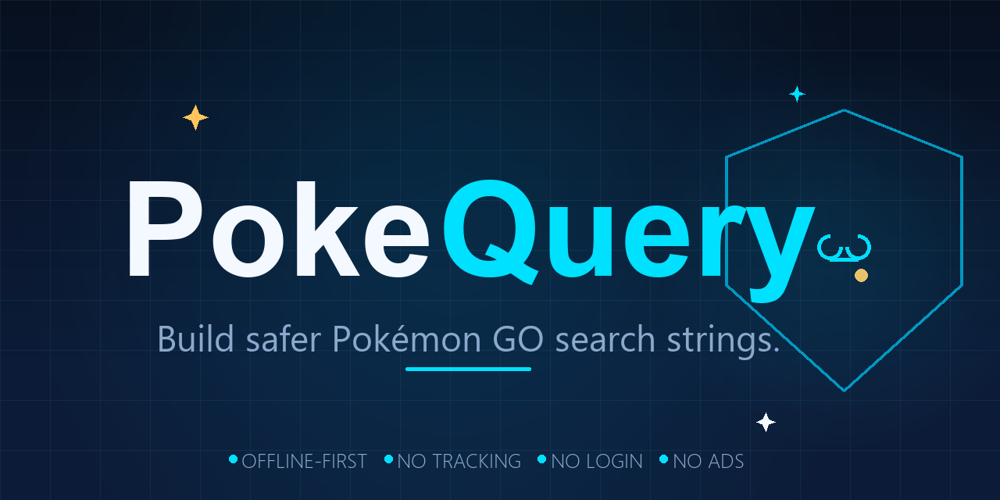
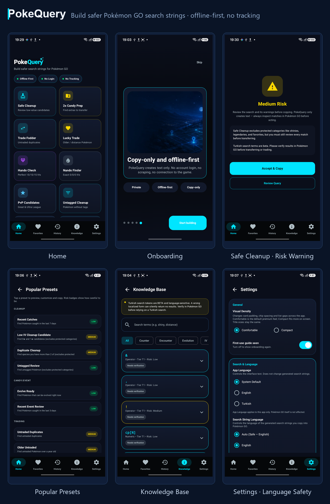
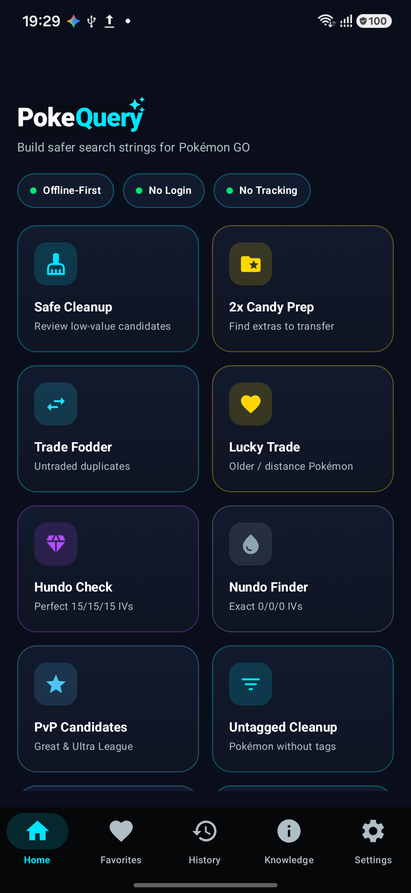
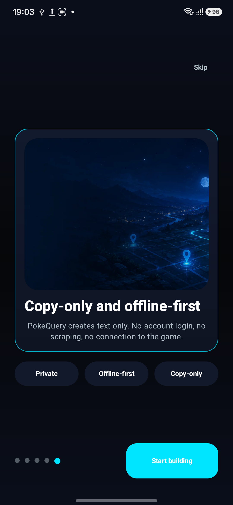
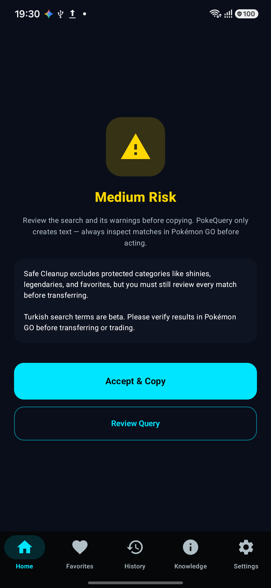
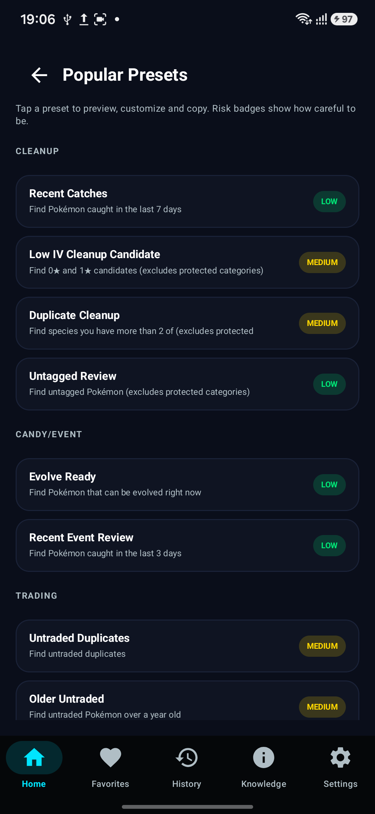
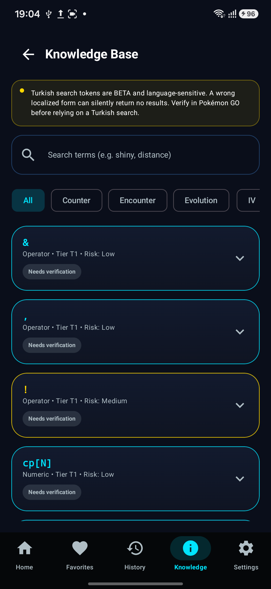
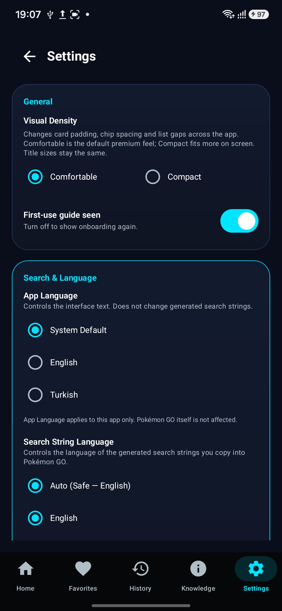

<p align="center">
  
</p>

<p align="center">
  <strong>Build safer Pokémon GO search strings.</strong><br/>
  An offline-first Android and Web/PWA utility that turns goals into copy-ready, safety-checked search strings.
</p>

<p align="center">
  
  
  
  
  
  
  
</p>

<p align="center">
  <em>Unofficial fan-made utility. Not affiliated with, endorsed by, or sponsored by Niantic, The Pokémon Company, or Nintendo.</em>
</p>

---

## What is PokeQuery?

PokeQuery is an **offline-first Android and Web/PWA companion utility** that helps Pokémon GO players organize their storage. You pick a goal such as *Safe Cleanup*, *2x Candy Prep*, *Trade Fodder* or *Event Guide*, and PokeQuery builds a carefully constructed **search string** from a tested rule engine. You then **manually copy** that string and **paste it into Pokémon GO** yourself.

It is **not** an IV checker, scanner, bot, automation tool, or Pokémon GO account tool. It generates text, and you decide what to do with it. Riskier copy/share actions are gated behind an explicit review step, and protected categories such as shiny, legendary, mythical, shadow, lucky, traded, favorite and high-IV Pokémon are excluded by default in safety-focused workflows.

> Why "safer"? Because a badly-built search string can surface the wrong Pokémon and lead to an accidental transfer. PokeQuery's engine is conservative: when in doubt, it protects rather than exposes.

---

## Screenshots

<p align="center">
  
</p>

<details>
<summary><strong>📸 Full screen gallery</strong></summary>

| | | |
|:---:|:---:|:---:|
|  |  |  |
| **Home** | **Onboarding** | **Safe Cleanup · Risk Warning** |
|  |  |  |
| **Popular Presets** | **Knowledge Base** | **Settings** |

</details>

---

## What can it do?

| Goal | What it does |
|---|---|
| 🧹 **Safe Cleanup** | Excludes high-IV (4★), shiny, legendary, mythical, ultra beast, costume, shadow, purified, favorite, lucky, and traded Pokémon so you can safely review low-IV catches for transfer. |
| 🍬 **2x Candy Prep** | Surfaces candidates worth transferring during a Candy bonus event while protecting rare and special forms. |
| 🔁 **Trade Fodder** | Builds a review list for common trade candidates while keeping protected categories visible. |
| ✨ **Lucky Trade** | Highlights older Pokémon more likely to go Lucky when traded. |
| 💯 **Hundo / Nundo** | Find perfect (4★) or worst (0★) IV entries for collection review. |
| ⚔️ **PvP Candidates** | League-specific (Great / Ultra) candidate filters for competitive review. |
| 📅 **Event Guide** | Surfaces active and upcoming in-game events with summaries, storage prep tips, and suggested search strings. Uses read-only public feed data with local caching and offline bundled fallback. |
| 🔧 **Expert Builder** | Compose your own query from grouped chips. Live preview plus a linter blocks unsafe combinations. |
| 📖 **Knowledge Base** | Researched entries on Pokémon GO search syntax, with tier and risk badges, sourced from official Help Center material and stored locally. |
| ⚡ **Popular Presets** | Curated, safety-reviewed one-tap strings for common tasks. |
| ⭐ **Favorites & History** | Save useful strings and revisit recent ones. Stored on-device only. |
| ↗ **Share Search** | Share a generated search through the system share sheet. Riskier searches keep the same review gate before sharing. |
| 🌐 **Language Safety** | App Language and Search String Language remain independent so changing the interface does not silently change an explicit output-language choice. |

---

## Safety-first by design

PokeQuery treats a search string as a **suggestion, not a command**. The app itself never modifies your Pokémon GO storage. It only produces text you choose to act on.

- **Risk Warning gate**: Medium/High-risk copy and share routes open an explicit review screen before the search leaves PokeQuery.
- **Protected by default**: shiny, legendary, mythical, ultra beast, costume, shadow, purified, favorite, lucky, traded, and high-IV (4★) Pokémon are excluded by default in safety-focused workflows.
- **Language resolution is explicit**: `Auto` follows a supported device locale and falls back to English for unsupported locales; explicit Search String Language choices remain independent.
- **No automation**: there is no transfer, delete, or batch-action button. PokeQuery cannot perform any action in Pokémon GO.
- **No account connection**: the app never logs into Pokémon GO or uses private game servers. Copy/paste is manual.
- **Linter**: the Expert Builder refuses to emit strings the engine considers unsafe, including unsupported pipe (`|`) syntax.

---

## Privacy

PokeQuery is privacy-first by design. Read the authoritative policy at [`privacy.html`](https://chaglaruk.github.io/PokeQuery/privacy.html).

| | |
|---|---|
| 👤 Accounts | None. No login, no registration, no sessions. |
| 🌐 Network | Read-only HTTPS access to the public GitHub-hosted Event Guide feed only. Cached locally for offline use. External share/rating actions are user-triggered Android intents, not background app networking. |
| 📊 Analytics | None. No crash SDKs, analytics, telemetry, attribution SDKs or tracking. |
| 🚫 Ads | None. |
| 💾 Storage | Favorites, history, presets, settings and local prompt state live on the device/browser only. |
| ☁️ Cloud sync | None. There is no remote user database. |

---

## Language support

PokeQuery keeps two language layers **fully independent**.

| Layer | Controls | Options |
|---|---|---|
| **App Language** | Interface text only | System Default · English · Türkçe · Deutsch · Español · Français · Italiano |
| **Search String Language** | The text you copy & paste into Pokémon GO | Auto · Match App Language · English · German · Spanish · French · Italian · Turkish |

- **`Auto`** follows the supported device locale and falls back to English for unsupported locales.
- **`Match App Language`** follows an explicit App Language; when App Language is System Default, it follows the supported device locale with English fallback.
- **Explicit search-language choices** resolve independently of App Language and device locale.
- Official localized Help Center evidence is treated as BETA under the current registry model; independent live localized-client confirmation is required for VERIFIED status.
- See [`docs/localization/official_search_token_matrix.md`](docs/localization/official_search_token_matrix.md) and [`docs/localization/localization_architecture.md`](docs/localization/localization_architecture.md) for the current model.

---

## Tech stack

- **Android App**: Kotlin + Jetpack Compose (Material 3), Navigation, ViewModel, DataStore Preferences (`minSdk 24`, `targetSdk 36`, `compileSdk 36`).
- **Web / PWA**: React + TypeScript + Vite + Workbox PWA service worker with offline caching.
- **Cross-Platform Engine**: deterministic `StringBuilderEngine`, `SearchTermMapper`, `ExpertCopyPolicy`, validated by a synchronized cross-platform `golden-corpus.json`.

---

## Build from source

> Android build requires JDK 17 and Android Studio. Web build requires Node.js 20+.

### Android
```bash
git clone https://github.com/chaglaruk/PokeQuery.git
cd PokeQuery
./gradlew :app:testDebugUnitTest
./gradlew :app:assembleDebug
```

### Web / PWA
```bash
cd web
npm ci
npm run typecheck
npm test
npm run build
```

---

## Testing & quality

| Check | What it guards |
|---|---|
| `./gradlew :app:testDebugUnitTest` | Android domain engine, expert linter, risk messages, localization invariants, popular-preset safety, saved-template codec, golden corpus parity. |
| `npm test` | Web engine parity, search intent parser, event lifecycle, golden corpus parity, UI/search-language behavior. |
| `npx playwright test` | Multi-browser PWA end-to-end flows across desktop, mobile Chrome and WebKit targets. |
| `python scripts/test_generator_safety.py` | Guards against pipe (`|`) generation in search strings and protects feed safety invariants. |
| `python scripts/check_runtime_assets.py` | Guards runtime asset policy. |

---

## Get PokeQuery

- **Android / Google Play:** <https://play.google.com/store/apps/details?id=com.caglar.pokequery>
- **Web / PWA:** <https://chaglaruk.github.io/PokeQuery/>
- **Search guides:** <https://chaglaruk.github.io/PokeQuery/guides/>

---

## Roadmap

These are realistic, in-scope directions:

- 🔬 Independent live-client confirmation of localized tokens (`BETA` -> `VERIFIED`)
- 🛡️ Safer, refined preset library additions
- ♿ Accessibility enhancements across Android and Web
- 📖 Expanded Knowledge Base entries
- 📅 Better event-prep sharing while preserving date/source truth and risk gates

---

## Disclaimer

PokeQuery is an **independent fan-made utility** and is **not affiliated with, endorsed by, or sponsored by Niantic, The Pokémon Company, or Nintendo**. Pokémon GO and all related marks, names, and characters are trademarks of their respective owners. PokeQuery does not access Pokémon GO accounts, automate gameplay, or use official Pokémon/Niantic/Nintendo runtime assets.

All artwork in this repository (app icon, wordmark, banners) is original. See [`docs/release/IP_ASSET_AUDIT.md`](docs/release/IP_ASSET_AUDIT.md).

---

## License

Released under the **MIT License**. See [`LICENSE`](LICENSE).

```
MIT License - Copyright (c) 2026 PokeQuery contributors
```

> Pokémon GO is a trademark of Niantic, Inc. / The Pokémon Company. This project
> neither uses nor redistributes any of their assets.
